# Design Document: CMS Foundation — Stage 1

## Overview

Stage 1 transforms the SSSSY page builder into an enterprise-grade CMS by addressing two categories of work:

1. **Critical Bug Fixes** — PropertyPanel data binding is broken for all 24 legacy section types because `migrateLegacySections()` does a shallow object spread that loses nested `items` arrays and bilingual field variants. The admin page editor (`admin/pages/[id]/page.tsx`) also holds stale React state when navigating between pages because the `useEffect` key is `[id]` but state is not cleared before the async fetch resolves.

2. **New CMS Capabilities** — Page creation wizard, URL slug management, page visibility/permission settings, token-based preview mode, workflow engine extension to pages, audit trail, media library (upload, folders, metadata), enhanced menu builder, SEO editor, page templates, page duplication, soft delete, multi-language management, and layout JSON validation/debug tooling.

### Technology Stack
- **Backend**: Spring Boot 3.x, Java 21, Maven, PostgreSQL 16, MinIO, Spring Security (JWT cookies)
- **Frontend**: Next.js 14, React 18, TypeScript, Tailwind CSS, @dnd-kit, fast-check (PBT)
- **Testing**: JUnit 5 + Mockito (backend), Vitest + fast-check (frontend)

---

## Architecture

```mermaid
graph TB
    subgraph Frontend ["Frontend (Next.js 14)"]
        AdminPages["/admin/pages/[id]\nEditPagePage"]
        PageBuilderRoot["PageBuilderRoot\n(undo/redo, layout state)"]
        BuilderCanvas["BuilderCanvas\n(@dnd-kit)"]
        PropertyPanel["PropertyPanel\n(auto-generated fields)"]
        PageWizard["CreatePageWizard\n(multi-step modal)"]
        MediaLibModal["MediaLibraryModal\n(grid + folder tree)"]
        MenuBuilder["/admin/menus\nDnD Tree"]
        SeoEditor["SEO Editor\n(SERP + OG preview)"]
        AuditTimeline["AuditTimeline\n(/admin/pages/[id]/history)"]
    end

    subgraph Backend ["Backend (Spring Boot 3)"]
        PageCtrl["PageController\n(existing + new endpoints)"]
        WorkflowCtrl["WorkflowController\n(extended to pages)"]
        MediaCtrl["MediaController\n(existing, enhanced)"]
        MenuCtrl["MenuController\n(existing, enhanced)"]
        PreviewCtrl["PreviewController\n(new)"]
        AuditCtrl["AuditController\n(new page endpoints)"]

        PageSvc["PageService"]
        WorkflowSvc["WorkflowEngine\n(extended)"]
        MediaSvc["MediaService\n(MinIO + DB)"]
        AuditSvc["PageAuditService"]
        PreviewSvc["PreviewService"]
        EmailSvc["EmailService\n(@Async notifications)"]

        MigrationLogic["migrateLegacySections()\npage-layout.ts (FE)"]
    end

    subgraph DB ["PostgreSQL 16"]
        Pages["pages"]
        PageSections["page_sections"]
        PageAudit["page_audit_trail (new)"]
        WorkflowTrans["workflow_transitions (new)"]
        PageTemplates["page_templates (new)"]
        MediaLib["media_library (new)"]
        MediaFolders["media_folders (existing)"]
        PreviewTokens["preview_tokens (new)"]
        UrlRedirects["url_redirects (new)"]
        PageSectionsBackup["page_sections_backup (new)"]
    end

    subgraph Storage ["MinIO"]
        Originals["originals/"]
        Thumbs["thumbs/"]
    end

    AdminPages --> PageBuilderRoot
    PageBuilderRoot --> BuilderCanvas
    PageBuilderRoot --> PropertyPanel
    AdminPages --> MigrationLogic

    PageCtrl --> PageSvc --> Pages
    PageCtrl --> PageSvc --> PageSections
    AuditCtrl --> AuditSvc --> PageAudit
    WorkflowCtrl --> WorkflowSvc --> WorkflowTrans
    PreviewCtrl --> PreviewSvc --> PreviewTokens
    MediaCtrl --> MediaSvc --> MediaLib
    MediaSvc --> Storage
    PageSvc --> EmailSvc

    Frontend --> Backend
    Backend --> DB
```



---

## Components and Interfaces

### 1. Frontend Components

#### 1.1 `migrateLegacySections()` Fix (page-layout.ts)

**Root cause**: The current implementation does `{ ...styling, ...config, ...data }` which correctly handles flat scalar keys but fails for two cases:
- `items` arrays (e.g., `data.panels`, `data.paragraphs`) are spread as individual keys instead of being assigned to the `items` prop key from BLOCK_SCHEMA.
- Bilingual variants that are missing in higher-precedence objects are dropped rather than defaulted to `""`.

**Fixed algorithm**:
```typescript
export function migrateLegacySections(sections: LegacyPageSection[]): PageLayout {
  const sorted = [...sections].sort((a, b) => (a.sortOrder ?? 0) - (b.sortOrder ?? 0));

  const blocks: Block[] = sorted.map((sec): Block => {
    const data    = (sec.data    ?? {}) as Record<string, unknown>;
    const config  = (sec.config  ?? {}) as Record<string, unknown>;
    const styling = (sec.styling ?? {}) as Record<string, unknown>;

    // Merge scalar fields: data wins > config > styling
    const mergedScalars: Record<string, unknown> = { ...styling, ...config, ...data };

    // Get BLOCK_SCHEMA fields for this type
    const schema = getBlockSchema(sec.componentType);
    const itemsField = schema.fields.find(f => f.kind === 'items');

    // Route items arrays to the correct props key
    if (itemsField) {
      const itemsKey = itemsField.key;
      // Look for arrays in data > config > styling
      const itemsSource =
        Array.isArray(data[itemsKey]) ? data[itemsKey] :
        // also check well-known legacy nested keys like data.panels, data.images, etc.
        findItemsArray(data, itemsKey) ??
        findItemsArray(config, itemsKey) ??
        findItemsArray(styling, itemsKey) ??
        [];
      mergedScalars[itemsKey] = itemsSource;
    }

    // Ensure bilingual field variants are always present (default to "")
    schema.fields.forEach(f => {
      if (f.key.endsWith('En') || f.key.endsWith('Ar')) {
        if (mergedScalars[f.key] === undefined) {
          mergedScalars[f.key] = '';
        }
      }
    });

    // Apply defaults for any still-missing props
    const props: Record<string, unknown> = {
      ...getDefaultProps(sec.componentType),
      ...mergedScalars,
    };

    if (sec.visibility) props.visibility = sec.visibility;

    return {
      id: sec.id || generateId(),
      type: sec.componentType,
      props: props as BlockProps,
      children: schema.isContainer ? [] : undefined,
    };
  });

  return { version: '1', blocks };
}

/** Scan an object for any array value, matching by itemsKey or by well-known nested names */
function findItemsArray(
  obj: Record<string, unknown>,
  itemsKey: string
): unknown[] | undefined {
  if (Array.isArray(obj[itemsKey])) return obj[itemsKey] as unknown[];
  // Legacy nested keys: panels, paragraphs, images, members, documents, events, etc.
  for (const value of Object.values(obj)) {
    if (Array.isArray(value) && value.length > 0) return value as unknown[];
  }
  return undefined;
}
```

#### 1.2 Admin Page Editor Navigation Fix (`admin/pages/[id]/page.tsx`)

**Root cause**: The `useEffect` depends on `[id]` but `setLayout` is only called after async `Promise.all` resolves. If you navigate from page A to page B quickly, the canvas briefly shows page A's blocks while page B is loading.

**Fix**: Clear state synchronously when `id` changes, then fetch.

```typescript
// Replace the existing useEffect:
useEffect(() => {
  if (id === 'new') { setLoading(false); return; }

  // ① Synchronously clear stale state before fetch
  setPage(null);
  setLayout(emptyLayout());
  setLegacySections([]);
  setLoading(true);

  let cancelled = false;

  Promise.all([
    getPage(id).catch(() => ({ data: { data: null } })),
    getPageSections(id).catch(() => ({ data: { data: [] } })),
  ]).then(([pageRes, sectionsRes]) => {
    if (cancelled) return; // guard: navigation happened again
    // ... rest of existing logic
  }).finally(() => {
    if (!cancelled) setLoading(false);
  });

  return () => { cancelled = true; };
}, [id]);
```

#### 1.3 New Frontend Components

**`CreatePageWizard`** (`/components/admin/pages/CreatePageWizard.tsx`)
- Multi-step modal; step indicator shows `current / total`
- Step 1: Title EN (required 1–200), Title AR (optional 0–200)
- Step 2: Slug field with real-time regex validation + uniqueness check via `GET /api/admin/pages/check-slug?slug=…`; live URL preview `{APP_URL}/{slug}`; max-length 200
- Step 3: Template selection grid (Blank, Article, Landing, About + any saved templates from `/api/admin/page-templates`), grouped by category
- On confirm: `POST /api/admin/pages` → redirect to `/admin/pages/[new-id]`
- Language selector (EN / AR) on Step 1

**`WorkflowStatusBadge`** (`/components/admin/WorkflowStatusBadge.tsx`)
- Props: `status: string`, `lastTransitionBy?: string`, `lastTransitionAt?: string`
- Color map: `DRAFT → bg-gray-100 text-gray-600`, `REVIEW → bg-yellow-100 text-yellow-700`, `APPROVED → bg-green-100 text-green-700`, `PUBLISHED → bg-blue-100 text-blue-700`, unknown → neutral gray
- Tooltip on hover: `{status} by {displayName} on {DD MMM YYYY HH:mm}`

**`WorkflowPanel`** (`/components/admin/pages/WorkflowPanel.tsx`)
- Displayed in page editor sidebar
- Shows current status badge, available action buttons (Submit for Review / Approve / Reject / Publish) based on user role and current state
- Rejection requires a non-empty reason textarea (1–1000 chars)

**`AuditTimeline`** (`/components/admin/pages/AuditTimeline.tsx`)
- Vertical timeline for `/admin/pages/{id}/history`
- Each entry: action label, user avatar + name, relative timestamp + full datetime on hover
- Filter controls: user dropdown, action type checkboxes
- Paginated (`page=0&size=20`), infinite scroll or page controls

**`MediaLibraryModal`** (`/components/admin/media/MediaLibraryModal.tsx`)
- Left sidebar: folder tree (root "All Media", folder create/rename/delete via context menu)
- Right area: image grid (300×300 thumbnails, 100 per page, pagination)
- Search input (≥1 char, queries backend FTS index)
- Upload zone: drag-and-drop or file picker, concurrency limit 5, per-file progress bars
- On select: close modal, populate image field with full-resolution URL
- Details panel: slides in on thumbnail click (alt EN/AR, caption EN/AR, tags, filename, size, dimensions, upload date, uploader)
- Yellow warning badge on thumbnails with empty `alt_text_en`

**`SeoEditorPanel`** (`/components/admin/pages/SeoEditorPanel.tsx`)
- Fields: meta_title (with live char counter, green ≤60, yellow=0, red >60), meta_description (same rules, limit 160), og_title, og_description, og_image (image picker with HEAD validation)
- Google SERP preview card below meta fields
- Open Graph preview card
- Fallback placeholder in meta_title when empty: shows page title

**`MenuBuilderPage`** (`/app/admin/menus/page.tsx` — enhanced)
- Tree rendered via @dnd-kit `SortableTree` pattern
- Drag item: updates `sort_order` and `parent_id` via `PATCH /api/admin/menus/{menuId}/items`
- Depth guard: reject drops that would exceed 3 levels, show tooltip "Maximum 3 levels of nesting"
- "Add Custom Link" form: label EN (required), label AR, URL (required, pattern validation), target
- Revert on backend error + error toast

**`PageDuplicateDialog`** / **`PageDeleteDialog`** — confirmation modals with pre-validation (menu links check, published page title confirmation)

**`LayoutJsonDebugModal`** — ADMIN-only "Debug: View JSON" button → read-only code editor (syntax highlighted) showing formatted layout_json

**`PageTemplatesPage`** (`/app/admin/templates/page.tsx`) — lists templates with name, category, usage count, created date, and screenshot thumbnail (placeholder if not captured)

### 2. Backend Components

#### 2.1 New / Extended Controllers

| Controller | Path | Notes |
|---|---|---|
| `PageController` (extended) | `/api/admin/pages` | Add workflow endpoints, audit, preview, debug, duplicate, restore, check-slug |
| `WorkflowController` (extended) | `/api/admin/pages/{id}/workflow` | Re-use `WorkflowEngine`, add page support |
| `PreviewController` (new) | `/api/preview/pages/{id}` | Token-based public access |
| `PageAuditController` (new) | `/api/admin/pages/{id}/audit-trail` | Paginated audit records |
| `MediaController` (extended) | `/api/admin/media`, `/api/admin/media-folders` | Library CRUD + folder ops |
| `PageTemplateController` (new) | `/api/admin/page-templates` | Template CRUD |
| `UrlRedirectController` (new) | Internal (no public endpoint) | Used by `PageService` on slug change |

#### 2.2 New Services

**`PageAuditService`** — writes to `page_audit_trail` on any page mutation; called from `PageService` via `@Transactional` after-save hooks.

**`PreviewService`** — generates 64-hex token (32 random bytes via `SecureRandom`), stores in `preview_tokens`, serves layout JSON for valid non-expired tokens.

**`PageWorkflowService`** — thin wrapper around existing `WorkflowEngine` scoped to pages; handles DRAFT→REVIEW→APPROVED→PUBLISHED transitions, validates role permissions, sends async email notifications.

**`MediaLibraryService`** — extends existing `MediaService`; adds folder management, FTS search queries, thumbnail generation, bulk-upload pipeline with UUID-prefixed filenames.

**`LayoutJsonValidator`** — pure utility class with `validate(String json): ValidationResult`; validates version, blocks array, per-block required fields, recursive children validation, duplicate ID detection; returns list of `{path, message}` errors.

#### 2.3 Layout JSON Validator Logic

```
validate(json):
  1. JSON.parse(json)           → fail: {path: "$", message: "invalid_json"}
  2. root has "version" (string) → fail: {path: "$.version", message: "missing_or_wrong_type"}
  3. root has "blocks" (array)   → fail: {path: "$.blocks", message: "missing_or_wrong_type"}
  4. collect all IDs via DFS
  5. for each block at index i:
       - has id (string, non-empty) → fail {path: "$.blocks[i].id", ...}
       - has type (string, non-empty) → fail {path: "$.blocks[i].type", ...}
       - has props (object) → fail {path: "$.blocks[i].props", ...}
       - if type unknown: log WARN, treat as leaf
       - if children present: recurse with path "$.blocks[i].children"
  6. check collected IDs for duplicates → fail {path: "$.blocks[i].id", message: "duplicate_id: {id}"}
  returns ValidationResult(errors=[])  // success
```

---

## Data Models

### New Database Tables (Flyway migration `V17__cms_foundation_stage1.sql`)

```sql
-- 1. Audit trail for all page changes
CREATE TABLE page_audit_trail (
    id              UUID DEFAULT gen_random_uuid() PRIMARY KEY,
    page_id         UUID NOT NULL REFERENCES pages(id),
    user_id         UUID NOT NULL REFERENCES users(id),
    action          VARCHAR(50) NOT NULL CHECK (action IN (
                      'CREATE','UPDATE','DELETE','PUBLISH','UNPUBLISH','WORKFLOW_TRANSITION'
                    )),
    timestamp       TIMESTAMP WITHOUT TIME ZONE NOT NULL DEFAULT (NOW() AT TIME ZONE 'UTC'),
    changed_fields  JSONB NOT NULL DEFAULT '{}'
    -- No FK cascade delete — audit records are append-only and retained indefinitely
);
CREATE INDEX idx_page_audit_page_id   ON page_audit_trail (page_id, timestamp DESC);
CREATE INDEX idx_page_audit_user_id   ON page_audit_trail (user_id);

-- 2. Workflow state transition history
CREATE TABLE workflow_transitions (
    id          UUID DEFAULT gen_random_uuid() PRIMARY KEY,
    page_id     UUID NOT NULL REFERENCES pages(id),
    from_state  VARCHAR(50) NOT NULL,
    to_state    VARCHAR(50) NOT NULL,
    user_id     UUID NOT NULL REFERENCES users(id),
    timestamp   TIMESTAMP WITHOUT TIME ZONE NOT NULL DEFAULT (NOW() AT TIME ZONE 'UTC'),
    notes       VARCHAR(1000)  -- rejection reason (nullable)
);
CREATE INDEX idx_wf_transitions_page ON workflow_transitions (page_id, timestamp DESC);

-- 3. Reusable page layout templates
CREATE TABLE page_templates (
    id          UUID DEFAULT gen_random_uuid() PRIMARY KEY,
    name        VARCHAR(100) NOT NULL,
    category    VARCHAR(50) NOT NULL CHECK (category IN ('Layout','Landing','About','Contact','Blog')),
    description VARCHAR(500),
    layout_json TEXT NOT NULL,
    thumbnail_url VARCHAR(1000),
    usage_count INTEGER NOT NULL DEFAULT 0,
    created_by  UUID NOT NULL REFERENCES users(id),
    created_at  TIMESTAMP WITHOUT TIME ZONE NOT NULL DEFAULT CURRENT_TIMESTAMP,
    updated_at  TIMESTAMP WITHOUT TIME ZONE NOT NULL DEFAULT CURRENT_TIMESTAMP
);

-- 4. Media library (replaces/supplements existing media_files)
-- NOTE: existing media_files table already has most needed columns.
-- Add missing columns via ALTER:
ALTER TABLE media_files
    ADD COLUMN IF NOT EXISTS caption_en  VARCHAR(500),
    ADD COLUMN IF NOT EXISTS caption_ar  VARCHAR(500),
    ADD COLUMN IF NOT EXISTS tags        TEXT,
    ADD COLUMN IF NOT EXISTS uploader_id UUID REFERENCES users(id),
    ADD COLUMN IF NOT EXISTS fts_index   TSVECTOR
        GENERATED ALWAYS AS (
            to_tsvector('english', coalesce(alt_text_en,'') || ' ' ||
                                   coalesce(alt_text_ar,'') || ' ' ||
                                   coalesce(caption_en,'') || ' ' ||
                                   coalesce(caption_ar,'') || ' ' ||
                                   coalesce(tags,'') || ' ' ||
                                   coalesce(original_filename,''))
        ) STORED;
CREATE INDEX IF NOT EXISTS idx_media_files_fts ON media_files USING GIN (fts_index);

-- The existing media_folders table is sufficient (id, name, parent_id, user_id, created_at, updated_at).
-- No additional columns needed.

-- 5. Preview tokens
CREATE TABLE preview_tokens (
    id          UUID DEFAULT gen_random_uuid() PRIMARY KEY,
    page_id     UUID NOT NULL REFERENCES pages(id),
    token       CHAR(64) NOT NULL UNIQUE,  -- 32 bytes hex-encoded
    layout_json TEXT NOT NULL,            -- snapshot of layout at preview time
    created_by  UUID NOT NULL REFERENCES users(id),
    expires_at  TIMESTAMP WITHOUT TIME ZONE NOT NULL,
    created_at  TIMESTAMP WITHOUT TIME ZONE NOT NULL DEFAULT CURRENT_TIMESTAMP
);
CREATE INDEX idx_preview_tokens_token ON preview_tokens (token);

-- 6. URL redirects (301 on slug change)
CREATE TABLE url_redirects (
    id              UUID DEFAULT gen_random_uuid() PRIMARY KEY,
    from_path       VARCHAR(500) NOT NULL,
    to_path         VARCHAR(500) NOT NULL,
    redirect_type   INTEGER NOT NULL DEFAULT 301,
    page_id         UUID REFERENCES pages(id),
    created_at      TIMESTAMP WITHOUT TIME ZONE NOT NULL DEFAULT CURRENT_TIMESTAMP
);
CREATE INDEX idx_url_redirects_from ON url_redirects (from_path);

-- 7. Migration backup
CREATE TABLE page_sections_backup AS TABLE page_sections WITH NO DATA;
-- (populated by migration script before any modifications)

-- 8. pages table additions
ALTER TABLE pages
    ADD COLUMN IF NOT EXISTS workflow_status     VARCHAR(50) NOT NULL DEFAULT 'DRAFT',
    ADD COLUMN IF NOT EXISTS allowed_roles       TEXT[],
    ADD COLUMN IF NOT EXISTS visibility          VARCHAR(50) NOT NULL DEFAULT 'PUBLIC',
    ADD COLUMN IF NOT EXISTS translation_group_id UUID,
    ADD COLUMN IF NOT EXISTS language            VARCHAR(10) NOT NULL DEFAULT 'EN',
    ADD COLUMN IF NOT EXISTS deleted_at          TIMESTAMP WITHOUT TIME ZONE,
    ADD COLUMN IF NOT EXISTS created_by          UUID REFERENCES users(id);

CREATE INDEX IF NOT EXISTS idx_pages_workflow_status ON pages (workflow_status);
CREATE INDEX IF NOT EXISTS idx_pages_translation_group ON pages (translation_group_id);
CREATE INDEX IF NOT EXISTS idx_pages_deleted_at ON pages (deleted_at);
```

### Key Data Shapes

**`PageResponse`** (extended to include new fields):
```json
{
  "id": "uuid",
  "titleEn": "About Us",
  "titleAr": "من نحن",
  "slug": "about-us",
  "language": "EN",
  "translationGroupId": "uuid",
  "workflowStatus": "DRAFT",
  "visibility": "PUBLIC",
  "allowedRoles": [],
  "isPublished": false,
  "layoutJson": "{\"version\":\"1\",\"blocks\":[...]}",
  "metaTitle": "...",
  "metaDescription": "...",
  "ogTitle": "...",
  "ogDescription": "...",
  "ogImageUrl": "...",
  "lastTransitionBy": "Ahmed Hassan",
  "lastTransitionAt": "2026-07-11T10:30:00Z",
  "createdAt": "...",
  "updatedAt": "...",
  "deletedAt": null
}
```

**`WorkflowTransitionRequest`**:
```json
{ "toState": "REVIEW", "notes": "optional rejection reason" }
```

**`PreviewTokenResponse`**:
```json
{ "token": "a3f9...64hexchars", "previewUrl": "/api/preview/pages/{id}?token=..." }
```

**`PageAuditRecord`**:
```json
{
  "id": "uuid",
  "action": "WORKFLOW_TRANSITION",
  "userId": "uuid",
  "userDisplayName": "Ahmed Hassan",
  "userAvatarUrl": "...",
  "timestamp": "2026-07-11T10:30:00Z",
  "changedFields": { "workflowStatus": { "before": "DRAFT", "after": "REVIEW" } }
}
```

**`MediaLibraryItem`** (response from `/api/admin/media`):
```json
{
  "id": "uuid",
  "filename": "uuid-original_name.jpg",
  "originalFilename": "original_name.jpg",
  "url": "https://minio.../originals/uuid-original_name.jpg",
  "thumbnailUrl": "https://minio.../thumbs/uuid-original_name_thumb.jpg",
  "mimeType": "image/jpeg",
  "sizeBytes": 245000,
  "width": 1920,
  "height": 1080,
  "altTextEn": "Soil sample analysis",
  "altTextAr": "تحليل عينة التربة",
  "captionEn": "",
  "captionAr": "",
  "tags": "soil,analysis,lab",
  "folderId": null,
  "uploaderDisplayName": "Fatima Khalil",
  "createdAt": "2026-07-01T08:00:00Z"
}
```

---

## API Endpoint Specifications

### Pages

| Method | Path | Auth | Description |
|--------|------|------|-------------|
| `POST` | `/api/admin/pages` | EDITOR+ | Create page; returns new page; sets `workflow_status=DRAFT` |
| `GET` | `/api/admin/pages` | EDITOR+ | List pages; supports `?workflowStatus=REVIEW&sort=updated_at,desc`; returns `workflowStatus`, `lastTransitionBy`, `lastTransitionAt` per page |
| `GET` | `/api/admin/pages/{id}` | EDITOR+ | Get page by ID; includes `layoutJson` and `sections` array |
| `PUT` | `/api/admin/pages/{id}` | EDITOR+ | Update page; validates `layoutJson` if provided |
| `DELETE` | `/api/admin/pages/{id}` | ADMIN | Soft delete (`deleted_at=NOW()`); returns 404 if already deleted |
| `POST` | `/api/admin/pages/{id}/restore` | ADMIN | Restore soft-deleted page (only within 30 days) |
| `POST` | `/api/admin/pages/{id}/duplicate` | EDITOR+ | Duplicate page; regenerate all block IDs; returns new page |
| `GET` | `/api/admin/pages/check-slug?slug=…&excludeId=…` | EDITOR+ | Returns `{available: true/false, suggestion: "slug-2"}` |
| `GET` | `/api/admin/pages/{id}/sections?format=flat` | EDITOR+ | Sections with `data`/`config`/`styling` as parsed JSON; `?format=flat` merges to single `props` object |
| `GET` | `/api/admin/pages/{id}/audit-trail?page=0&size=20` | EDITOR+ | Paginated audit records sorted by `timestamp DESC` |
| `GET` | `/api/admin/pages/{id}/layout-json` | ADMIN | Pretty-printed `layout_json` (2-space indent, raw UTF-8) |

### Workflow

| Method | Path | Auth | Description |
|--------|------|------|-------------|
| `GET` | `/api/admin/pages/{id}/workflow` | EDITOR+ | Returns `{currentState, availableTransitions, history[]}` |
| `PATCH` | `/api/admin/pages/{id}/workflow` | Role-dependent | Body: `WorkflowTransitionRequest`; validates role + source state; inserts `workflow_transitions` row; returns updated `workflowStatus` |

**Transition permission matrix**:

| Transition | Required Role |
|---|---|
| DRAFT → REVIEW | EDITOR, PUBLISHER, ADMIN |
| REVIEW → APPROVED | PUBLISHER, ADMIN |
| REVIEW → DRAFT (reject) | PUBLISHER, ADMIN |
| APPROVED → PUBLISHED | PUBLISHER, ADMIN |

### Preview

| Method | Path | Auth | Description |
|--------|------|------|-------------|
| `POST` | `/api/preview/pages/{id}` | EDITOR+ | Generate preview token; store `layout_json` snapshot; return `{token, previewUrl, expiresAt}` |
| `GET` | `/api/preview/pages/{id}?token={token}` | None | Serve preview if token valid + not expired; return layout JSON; HTTP 403 if invalid/expired |

### Media Library

| Method | Path | Auth | Description |
|--------|------|------|-------------|
| `GET` | `/api/admin/media?folderId=&search=&page=0&size=100` | EDITOR+ | List media; FTS search if `search` provided |
| `POST` | `/api/admin/media` | EDITOR+ | Upload single file (multipart); validate MIME + size; store in MinIO; generate 300×300 thumb; insert `media_files` row |
| `PATCH` | `/api/admin/media/{id}` | EDITOR+ | Update `alt_text_en`, `alt_text_ar`, `caption_en`, `caption_ar`, `tags`, `folder_id` |
| `DELETE` | `/api/admin/media/{id}` | ADMIN | Delete file from MinIO + DB |
| `GET` | `/api/admin/media-folders` | EDITOR+ | List folder tree |
| `POST` | `/api/admin/media-folders` | EDITOR+ | Create folder; body `{name, parentId}` |
| `PATCH` | `/api/admin/media-folders/{id}` | EDITOR+ | Rename folder |
| `DELETE` | `/api/admin/media-folders/{id}` | ADMIN | Delete folder; set `folder_id=NULL` on all contained images |

**File validation** (applied in `MediaController` before storage):
- `mimeType` must be `image/jpeg`, `image/png`, `image/gif`, or `image/webp`
- `sizeBytes` must be ≤ 10,485,760 (10 MB)
- Violations return HTTP 422: `{"error": "invalid_file", "reason": "unsupported_type|size_exceeded"}`

### Page Templates

| Method | Path | Auth | Description |
|--------|------|------|-------------|
| `GET` | `/api/admin/page-templates` | EDITOR+ | List templates grouped by category |
| `POST` | `/api/admin/page-templates` | ADMIN | Create template from current page's `layout_json` |
| `DELETE` | `/api/admin/page-templates/{id}` | ADMIN | Delete template |

### Menu Updates

| Method | Path | Auth | Description |
|--------|------|------|-------------|
| `PATCH` | `/api/admin/menus/{menuId}/items` | ADMIN | Update `sort_order` and `parent_id` for a moved item; validates nesting depth ≤ 3 |
| `GET` | `/api/admin/menus/items?pageId={id}` | EDITOR+ | Find menu items linked to a page (for deletion safety check) |

---

## Data Flow Diagrams

### Critical Path 1 — Legacy Page Load & PropertyPanel Binding

```
Browser                   Frontend                      Backend                  DB
  │                          │                              │                     │
  │ navigate /admin/pages/X  │                              │                     │
  │─────────────────────────►│                              │                     │
  │                          │ setPage(null)                │                     │
  │                          │ setLayout(emptyLayout())     │                     │
  │                          │ setLoading(true)             │                     │
  │                          │──── GET /admin/pages/X ─────►│                     │
  │                          │──── GET /admin/pages/X/      │                     │
  │                          │       sections ─────────────►│── SELECT pages ────►│
  │                          │                              │◄── page row ────────│
  │                          │                              │── SELECT sections ──►│
  │                          │                              │◄── sections rows ───│
  │                          │◄── {layoutJson, sections} ───│                     │
  │                          │                              │                     │
  │                          │ if (layoutJson)              │                     │
  │                          │   parseLayout(layoutJson)    │                     │
  │                          │ else                         │                     │
  │                          │   migrateLegacySections()    │                     │
  │                          │   ┌─ merge data>config>      │                     │
  │                          │   │   styling into props     │                     │
  │                          │   │  route items arrays      │                     │
  │                          │   └─ ensure bilinguals       │                     │
  │                          │ setLayout(resolved)          │                     │
  │                          │ setLoading(false)            │                     │
  │◄── canvas renders ───────│                              │                     │
  │ PropertyPanel reads      │                              │                     │
  │ block.props[field.key]   │                              │                     │
  │ → fields populated ✓    │                              │                     │
```

### Critical Path 2 — Workflow Transition (Submit for Review)

```
Frontend                    Backend                       EmailService
  │                            │                               │
  │ PATCH /pages/X/workflow     │                               │
  │ {toState:"REVIEW"}         │                               │
  │───────────────────────────►│                               │
  │                            │ validateRole(EDITOR ✓)        │
  │                            │ validateState(DRAFT→REVIEW ✓) │
  │                            │ BEGIN TRANSACTION             │
  │                            │── UPDATE pages SET            │
  │                            │    workflow_status='REVIEW'   │
  │                            │── INSERT workflow_transitions │
  │                            │── INSERT page_audit_trail     │
  │                            │    action='WORKFLOW_TRANSITION'│
  │                            │ COMMIT                        │
  │                            │── @Async: send emails ───────►│
  │◄── 200 {workflowStatus:    │                               │ fetch REVIEWER/PUBLISHER users
  │         "REVIEW"}          │                               │ send email per user
  │                            │                               │ INSERT email_logs rows
```

### Critical Path 3 — Media Upload

```
Frontend (5 concurrent)         Backend                    MinIO              DB
  │                                │                          │                │
  │ POST /media (multipart)        │                          │                │
  │───────────────────────────────►│                          │                │
  │                                │ validate MIME + size     │                │
  │                                │ generate UUID-filename   │                │
  │                                │── PUT object ───────────►│                │
  │                                │◄── 200 OK ───────────────│                │
  │                                │── generate 300x300 thumb │                │
  │                                │── PUT thumb_object ─────►│                │
  │                                │◄── 200 OK ───────────────│                │
  │                                │── INSERT media_files ────────────────────►│
  │◄── 201 {id, url, thumbnailUrl} │                          │                │
  │ update grid (no refresh)       │                          │                │
```

---

## Correctness Properties

*A property is a characteristic or behavior that should hold true across all valid executions of a system — essentially, a formal statement about what the system should do. Properties serve as the bridge between human-readable specifications and machine-verifiable correctness guarantees.*

### Property 1: Migration Merge Precedence

*For any* legacy section with overlapping keys in `data`, `config`, and `styling`, the flattened `props` object produced by `migrateLegacySections()` SHALL assign the value from `data` if present, otherwise from `config`, otherwise from `styling`.

**Validates: Requirements 1.4, 3.2**

---

### Property 2: Bilingual Field Completeness

*For any* legacy section whose BLOCK_SCHEMA declares bilingual fields (keys ending in `En`/`Ar`), the `props` produced by `migrateLegacySections()` SHALL contain both variants, using an empty string `""` for any variant absent from the source objects — never `undefined`.

**Validates: Requirements 1.6**

---

### Property 3: Items Array Routing

*For any* legacy section whose BLOCK_SCHEMA contains exactly one field with `kind === "items"`, calling `migrateLegacySections()` on that section SHALL assign any array found in `data`, `config`, or `styling` to `props[itemsField.key]` — not as individual spread keys.

**Validates: Requirements 1.5**

---

### Property 4: Layout Resolution Precedence

*For any* combination of `(layoutJson, sections)` passed to `resolvePageLayout()`, the function SHALL return a `PageLayout` parsed from `layoutJson` when `layoutJson` is a non-empty string, regardless of the contents of `sections`.

**Validates: Requirements 2.4**

---

### Property 5: Slug Format Validation

*For any* string input to the slug validator, the validator SHALL accept it if and only if it matches `^[a-z0-9]+(?:-[a-z0-9]+)*$`. In particular, strings with uppercase letters, underscores, leading/trailing hyphens, or consecutive hyphens SHALL be rejected.

**Validates: Requirements 5.3, 6.2**

---

### Property 6: Layout JSON Round-Trip Integrity

*For any* valid `PageLayout` object (with random block types, props values, and nesting depth up to 5 levels, including Arabic Unicode strings), serializing to JSON and then deserializing SHALL produce an object deeply equal to the original. This property SHALL hold for 500 generated inputs.

**Validates: Requirements 26.1, 26.2, 26.3, 26.4, 26.5, 26.6**

---

### Property 7: Block ID Uniqueness After Duplication

*For any* `layout_json` containing an arbitrary block tree, duplicating a page via `POST /api/admin/pages/{id}/duplicate` SHALL produce a new `layout_json` where every block ID — at all nesting depths — is different from every block ID in the original `layout_json`.

**Validates: Requirements 21.7**

---

### Property 8: Layout JSON Validator Rejects Malformed Input

*For any* JSON string missing any of `version` (string), `blocks` (array), or containing a block element missing any of `id` (non-empty string), `type` (non-empty string), `props` (object), the `LayoutJsonValidator` SHALL return a non-empty errors list with a `path` pointing to the missing or wrong-type field.

**Validates: Requirements 24.1, 24.2, 24.3, 24.4, 24.5**

---

### Property 9: Duplicate Block ID Detection

*For any* `layout_json` where two or more blocks share the same `id` value (at any nesting depth), the `LayoutJsonValidator` SHALL include an error entry identifying the duplicate ID.

**Validates: Requirements 24.6**

---

### Property 10: File Upload Type and Size Gate

*For any* file upload request, the backend SHALL accept the file if and only if its MIME type is one of `{image/jpeg, image/png, image/gif, image/webp}` AND its size in bytes is ≤ 10,485,760. Any file failing either condition SHALL be rejected with HTTP 422.

**Validates: Requirements 15.3, 15.6, 17.5**

---

### Property 11: Workflow State Machine Validity

*For any* workflow transition request `(fromState, toState, userRole)`, the backend SHALL approve the transition if and only if the pair `(fromState → toState)` is in the allowed transition set AND the `userRole` has permission for that transition. Any request violating either condition SHALL be rejected — the page state SHALL remain unchanged.

**Validates: Requirements 9.8, 9.9, 9.10**

---

### Property 12: Workflow Status Badge Color Mapping

*For any* `workflowStatus` value, the rendered `WorkflowStatusBadge` SHALL apply exactly the CSS classes specified: `DRAFT → bg-gray-100 text-gray-600`, `REVIEW → bg-yellow-100 text-yellow-700`, `APPROVED → bg-green-100 text-green-700`, `PUBLISHED → bg-blue-100 text-blue-700`, and any unrecognized value SHALL render a neutral gray badge without throwing.

**Validates: Requirements 10.2**

---

### Property 13: SEO Character Counter Color Rules

*For any* character count `n` in the meta_title field, the live counter SHALL display green when `1 ≤ n ≤ 60`, yellow when `n = 0`, and red when `n > 60`. The same thresholds apply for meta_description with a 160-character limit.

**Validates: Requirements 19.2, 19.3**

---

### Property 14: Menu Nesting Depth Constraint

*For any* drag-drop operation that would produce a menu item nesting depth strictly greater than 3, the frontend SHALL reject the drop and leave the menu tree state unchanged.

**Validates: Requirements 14.3, 14.8**

---

## Error Handling

### Frontend Error Patterns

| Scenario | UX Response |
|---|---|
| Page load API failure | Error banner + "Retry" button; retry limit 3; show attempt count |
| Save failure | Toast: "Save failed — please try again"; preserve dirty state |
| Slug conflict | Inline error "This slug is already taken"; suggest `-2`/`-3` alternative |
| Workflow transition failure | Toast with error detail; page state not changed in UI |
| Media upload failure (single file) | Per-file error row with "Retry"; other files continue |
| Media folder move failure | Revert image to original folder in UI; error toast |
| Menu drag-drop failure | Revert tree to pre-drag state; error toast |
| Preview token generation failure | Toast; Preview button re-enabled |
| OG image URL unreachable | Inline non-blocking warning below og_image field |

### Backend Error Contract

All error responses follow the existing `ApiResponse` shape plus an `errors` array for validation failures:

```json
{
  "success": false,
  "message": "Validation failed",
  "errors": [
    { "path": "$.blocks[2].id", "message": "missing_or_empty" }
  ]
}
```

Specific HTTP status codes:
- `400` — Invalid input (JSON parse failure, missing fields, invalid state transition)
- `401` — Unauthenticated (page with `visibility != PUBLIC`)
- `403` — Insufficient role or expired preview token
- `404` — Page not found or soft-deleted
- `409` — Slug conflict
- `422` — File validation failure (wrong type or size)
- `500` — Unexpected server error (MinIO unavailable, DB error)

### Backend Resilience

- **Email service unavailability**: Workflow state transition completes in the DB transaction; email dispatch is `@Async` and logged to `email_logs` with `status=FAILED`. A scheduler retries failed emails.
- **MinIO unavailability during upload**: `MediaService` catches `S3Exception`, returns HTTP 500, no DB row is written.
- **Migration script failure**: Wrapped in a single `BEGIN`/`COMMIT` transaction per batch; any exception triggers `ROLLBACK` and logs `{sectionId, error}`.

---

## Testing Strategy

### Unit Tests (Vitest + JUnit 5)

**Frontend unit tests** focus on pure transformation functions:
- `migrateLegacySections()` with representative inputs for each of the 24 legacy types
- `resolvePageLayout()` with all combinations of (layoutJson present/absent, sections empty/populated)
- Slug format validation regex
- `WorkflowStatusBadge` rendering for each known status and one unknown value
- SEO character counter color logic

**Backend unit tests** focus on:
- `LayoutJsonValidator` with hand-crafted invalid payloads
- `PageWorkflowService` transition validation for all valid and invalid (state, role) combinations
- `MediaService` file validation logic (MIME + size rules)
- `PreviewService` token generation and expiry checking

### Property-Based Tests (fast-check + Vitest, frontend)

Each property test runs **500 iterations** minimum (per Requirement 26.2) and references the corresponding design property with a tag comment.

```typescript
// Feature: cms-foundation-stage1, Property 6: Layout JSON Round-Trip Integrity
it('layout_json round-trip preserves deep equality', () => {
  fc.assert(fc.property(
    arbitraryPageLayout({ maxDepth: 5 }),
    (layout) => {
      const serialized = serializeLayout(layout);
      const parsed = parseLayout(serialized);
      expect(parsed).toEqual(layout);
    }
  ), { numRuns: 500, seed: 42 });
});
```

Property-based test coverage plan:

| Property | PBT Library | Arbitrary Type | Runs |
|---|---|---|---|
| 1 — Migration merge precedence | fast-check | Random `{data,config,styling}` with overlapping keys | 500 |
| 2 — Bilingual field completeness | fast-check | Random legacy sections with partial bilingual fills | 500 |
| 3 — Items array routing | fast-check | Random sections with known items-having block types | 500 |
| 4 — Layout resolution precedence | fast-check | Random `(layoutJson?, sections[])` combinations | 500 |
| 5 — Slug format validation | fast-check | `fc.string()` with all printable chars | 1000 |
| 6 — Round-trip integrity | fast-check | `arbitraryPageLayout({maxDepth:5})` with Arabic strings | 500 |
| 7 — Block ID uniqueness after duplication | fast-check | Random `PageLayout` objects | 500 |
| 8/9 — Validator rejects malformed | fast-check | Randomly corrupt valid layouts | 500 |
| 10 — File upload gate | fast-check | Random `{mimeType, sizeBytes}` pairs | 1000 |
| 11 — Workflow state machine | fast-check | Random `(fromState, toState, role)` triples | 500 |
| 12 — Badge color mapping | fast-check | `fc.string()` workflow status values | 500 |
| 13 — SEO char counter colors | fast-check | `fc.integer({min:0,max:300})` | 500 |
| 14 — Menu nesting depth | fast-check | Random tree structures + drop targets | 500 |

### Integration Tests

- `POST /api/admin/pages/{id}/workflow` with real DB: verify `workflow_transitions` row inserted, page `workflow_status` updated, prior state left unchanged on invalid transition
- `POST /api/admin/media` with real MinIO: verify file stored, thumb generated, DB row created; verify DB row NOT created on MinIO failure
- `GET /api/preview/pages/{id}?token=…` with expired token: verify HTTP 403
- Page slug conflict: verify HTTP 409 with `conflictingPageId`

### Migration Testing

Per Requirement 3.9, after running the data migration script, each migrated section is verified by running it through the frontend `migrateLegacySections()` parser. This is implemented as a post-migration validation step in the Flyway script itself (via a PL/pgSQL function that checks the JSON structure of all migrated rows).

---

## Migration Strategy

### Legacy Data Migration (REQ-3)

The migration runs as Flyway script `V17__cms_foundation_stage1.sql` plus an accompanying server-side script (`MigrateLegacySectionsScript.java`) executed once at startup.

**Steps**:
1. **Backup**: `INSERT INTO page_sections_backup SELECT * FROM page_sections` — entire table copied before any modifications.
2. **Transaction per page**: For each `page_id` group in `page_sections` where `component_type IN LEGACY_SECTION_TYPES`:
   a. Read all sections for the page.
   b. For each section, flatten `data > config > styling` into a merged JSON object.
   c. Route `items` arrays to the correct key.
   d. Validate via the same logic as `migrateLegacySections()`.
   e. Log `{sectionId, componentType, beforeJson, afterJson}`.
   f. UPDATE `page_sections.data = mergedProps::jsonb`, clear `config` and `styling`.
   g. UPDATE `pages.layout_json = migrated_tree_json`.
   h. UPDATE `page_sections.updated_at = NOW()`.
3. **Rollback on failure**: Each page's batch is wrapped in a savepoint. If any section fails, the savepoint is rolled back and the failure is logged.
4. **Post-migration validation**: For each migrated page, fetch its sections and verify `migrateLegacySections()` produces a layout with no parse errors (all block types found in BLOCK_SCHEMA, all `items` fields are arrays).

### Frontend Migration Flow (Zero-Downtime)

Pages not yet migrated continue to work via the on-the-fly `migrateLegacySections()` path in `resolvePageLayout()`. The "⚡ Migrate to Block Builder" button remains visible until `pages.layout_json` is populated. After the batch migration script runs, all pages will have `layout_json` set and the migration button will disappear.

### `pages` Table New Columns Backfill

After adding new columns:
- `workflow_status = 'PUBLISHED'` for all pages where `is_published = true`
- `workflow_status = 'DRAFT'` for all pages where `is_published = false`
- `language = 'EN'` for all existing pages
- `visibility = 'PUBLIC'` for all existing pages
- `created_by`: left NULL (backfill not feasible without data)
